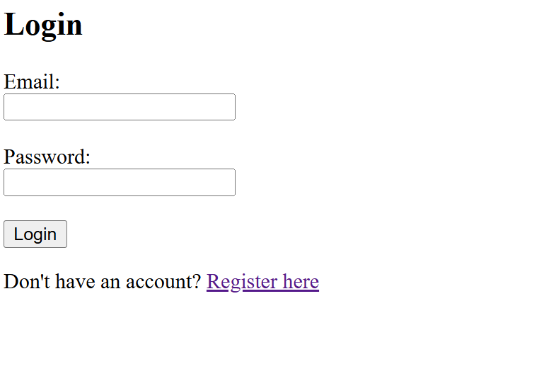

# 🛡️ RRole-Based Access Control System (RBAC + Organizations + Guests)


A minimal **Role-Based Access Control (RBAC)** system built using **FastAPI** with:
- JWT Authentication
- Organization & Department management
- Role assignment
- Resource upload/view
- Guest access to resources

---

## 🚀 Features

- ✅ User registration & login with JWT
- ✅ Create organizations and departments
- ✅ Assign roles to users (Viewer, Editor, Admin)
- ✅ Upload and view resources (title + content)
- ✅ Generate guest-accessible links to view resources

---

## 🏗️ Tech Stack

- **Backend**: FastAPI
- **ORM**: SQLAlchemy
- **Database**: MySQL (can switch to PostgreSQL/SQLite)
- **Templates**: Jinja2
- **Auth**: OAuth2 + JWT (via `python-jose`)
- **Password Hashing**: passlib
- **Guest links**: Dynamic URLs

---

## 🛠️ Setup Instructions

### 1. Clone the Repository
```bash
git clone https://github.com/Ankith15/AI_backend.git
cd Task2/app
````

### 2. Install Requirements

```bash
pip install -r requirements.txt
```

### 3. Configure `.env`

Create a `.env` file in the root with the following:

```
DB_HOST=localhost
DB_PORT=3306
DB_NAME=rbac_db
DB_USER=root
DB_PASSWORD=yourpassword
SECRET_KEY=your_secret_key
ALGORITHM=HS256
ACCESS_TOKEN_EXPIRE_MINUTES=30
```

### 4. Create MySQL Database

```sql
CREATE DATABASE rbac_db;
```

### 5. Run the Server

```bash
uvicorn app.main:app --reload
```

---

## 🌐 App Structure

```
.
├── app/
│   ├── db/
│   │   └── database.py
│   ├── models/
│   │   ├── user.py
│   │   ├── org.py
│   │   ├── dept.py
│   │   └── resource.py
│   ├── routes/
│   │   ├── auth.py
│   │   ├── org_dept.py
│   │   ├── roles.py
│   │   └── resources.py
│   ├── templates/
│   │   ├── login.html
│   │   ├── dashboard.html
│   │   ├── create_org.html
│   │   ├── create_dept.html
│   │   ├── assign_role.html
│   │   ├── upload_resource.html
│   │   ├── view_resources.html
│   │   └── guest_view.html
│   ├── utils/
│   │   ├── hash.py
│   │   └── jwt.py
│   └── main.py
├── .env
├── requirements.txt
└── README.md
```

---

## 🔑 User Flow

1. 🔐 **Register** and **login** to receive a JWT
2. 🏢 Create **organization** and **department**
3. 👥 Assign **roles** to registered users
4. 📄 Upload **resources** (title + content)
5. 🔗 View resources and get **guest shareable links**
6. 🌍 Guest can access the link without login

---

## 📮 API Routes Overview

| Method | Path                   | Description                     |
| ------ | ---------------------- | ------------------------------- |
| POST   | `/register`            | Register a new user             |
| POST   | `/login`               | Login and get JWT token         |
| GET    | `/org/create-form`     | Form to create organization     |
| POST   | `/org/create-form`     | Create organization             |
| GET    | `/dept/create-form`    | Form to create department       |
| POST   | `/dept/create-form`    | Create department               |
| GET    | `/assign-role`         | Form to assign role             |
| POST   | `/assign-role`         | Assign role to user             |
| GET    | `/resource/upload`     | Upload resource form            |
| POST   | `/resource/upload`     | Upload resource to DB           |
| GET    | `/resource/view`       | View all user resources         |
| GET    | `/guest/resource/{id}` | Guest view of a shared resource |

---

## 📷 Screenshots




---

## 🙌 Done By

**Ankith** 

```

